# Project 01: Exploring and Visualizing the Iris Dataset


---

## Table of Contents

- Project Results
- Project Overview
- Project Objectives
- Dataset Information
- Technologies Used
- Project Structure
- Dataset Analysis
- Data Visualization
- Key Findings
- Conclusion
- How to Run the Project
- Author

---

## Project Results

| Metric | Status |
|---------|---------|
| Dataset Loading | Completed |
| Records Analyzed | 150 |
| Features Analyzed | 6 |
| Missing Values Check | Passed |
| Duplicate Records Check | Passed |
| Species Distribution Analysis | Completed |
| Exploratory Data Analysis | Completed |
| Data Visualization | Completed |

---

## Project Overview

This project focuses on exploring and visualizing the famous Iris Dataset using Python, Pandas, Matplotlib, and Seaborn. The main goal is to understand the structure of the dataset, perform data quality checks, generate summary statistics, and create visualizations to identify patterns and relationships among iris flower species.

This project was completed as part of the **Data Science & Analytics Internship program**.

---

## Project Objectives

The objectives of this project are:

* Load and explore the Iris Dataset
* Understand the dataset structure and features
* Perform basic data quality checks
* Analyze descriptive statistics
* Identify missing and duplicate values
* Visualize data using different plots
* Understand relationships between features
* Extract meaningful insights from the dataset

---

## Dataset Information

The Iris Dataset contains measurements of iris flowers from three different species:

* Iris-setosa
* Iris-versicolor
* Iris-virginica

### Features

| Feature       | Description                 |
| ------------- | --------------------------- |
| Id            | Unique identifier           |
| SepalLengthCm | Sepal length in centimeters |
| SepalWidthCm  | Sepal width in centimeters  |
| PetalLengthCm | Petal length in centimeters |
| PetalWidthCm  | Petal width in centimeters  |
| Species       | Iris flower species         |

### Dataset Summary

| Metric            | Value |
| ----------------- | ----- |
| Total Records     | 150   |
| Total Columns     | 6     |
| Missing Values    | 0     |
| Duplicate Records | 0     |

---

## Technologies Used

* Python
* Pandas
* NumPy
* Matplotlib
* Seaborn
* Jupyter Notebook

---

## Project Structure

```text
Project-01-Iris-Analysis/
│
├── data/
│   └── Iris.csv
│
├── notebooks/
│   └── iris_analysis.ipynb
│
├── outputs/
│   ├── datasets/
│   └── figures/
│
├── requirements.txt
└── README.md
```

---

## Dataset Analysis Summary

| Step | Description                |
| ---- | -------------------------- |
| 01   | Dataset Shape Analysis     |
| 02   | Column Names Inspection    |
| 03   | Dataset Preview            |
| 04   | Dataset Information        |
| 05   | Descriptive Statistics     |
| 06   | Species Distribution       |
| 07   | Missing Values Analysis    |
| 08   | Duplicate Records Analysis |

---

## Dataset Analysis

## 01. Dataset Shape

<p align="center">
  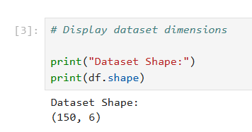
</p>

### Explanation

The dataset contains 150 rows and 6 columns. Each row represents an individual iris flower sample, while the columns contain flower measurements and species information.

---

## 02. Column Names

<p align="center">
  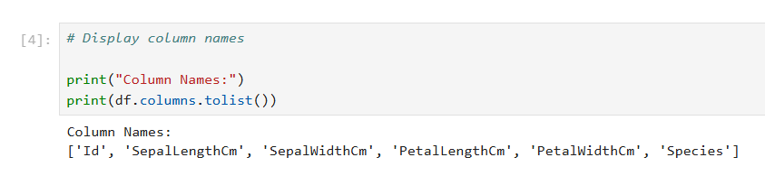
</p>

### Explanation

The dataset contains six columns: Id, SepalLengthCm, SepalWidthCm, PetalLengthCm, PetalWidthCm, and Species. The Id column uniquely identifies each record, while the remaining columns store flower measurements and species labels.

---

## 03. Dataset Preview

<p align="center">
  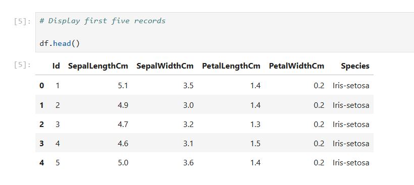
</p>

### Explanation

The first five records provide an initial view of the dataset. The preview confirms that the data has been loaded correctly and shows the structure of the available features.

---

## 04. Dataset Information

<p align="center">
  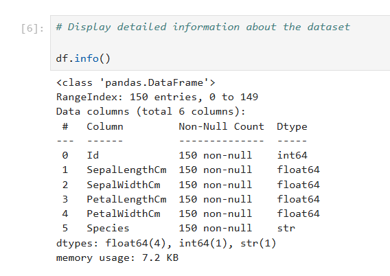
</p>

### Explanation

The dataset contains 150 non-null observations for all columns. Numerical features are stored as floating-point values, while the Species column is categorical. No missing values are present.

---

## 05. Descriptive Statistics

<p align="center">
  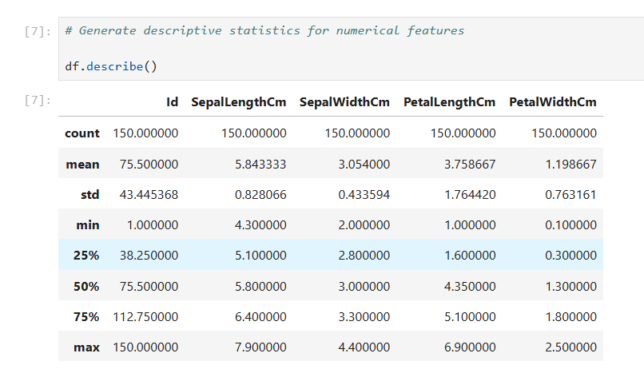
</p>

### Explanation

Descriptive statistics summarize the distribution of numerical features. The table provides information such as mean, standard deviation, minimum, maximum, and quartile values, helping to understand the overall characteristics of the dataset.

---

## 06. Species Distribution

<p align="center">
  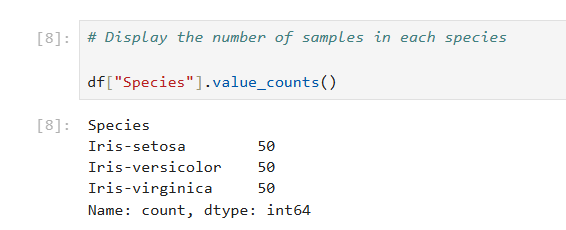
</p>

### Explanation

Each iris species contains 50 observations. This balanced distribution ensures fair representation of all classes and supports reliable analysis and visualization.

---

## 07. Missing Values Analysis

<p align="center">
  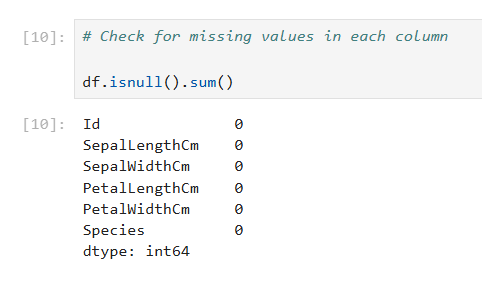
</p>

### Explanation

No missing values were detected in any column of the dataset. Since all records are complete, no data imputation or missing-value treatment was required.

---

## 08. Duplicate Records Analysis

<p align="center">
  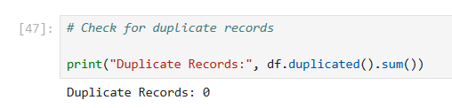
</p>

### Explanation

The duplicate record check returned zero duplicate entries. This indicates that each observation is unique and no duplicate removal was necessary.

---

# Data Visualization Summary

| Visualization                     | Purpose                                                   |
| --------------------------------- | --------------------------------------------------------- |
| Scatter Plot (Petal Measurements) | Analyze relationship between petal length and petal width |
| Scatter Plot (Sepal Measurements) | Analyze relationship between sepal length and sepal width |
| Histogram (Sepal Length)          | Examine sepal length distribution                         |
| Histogram (Petal Length)          | Examine petal length distribution                         |
| Box Plot (Sepal Length)           | Identify spread and potential outliers                    |
| Box Plot (Petal Length)           | Compare petal length distributions across species         |

---

## Data Visualization

## 09. Scatter Plot: Petal Length vs Petal Width

<p align="center">
  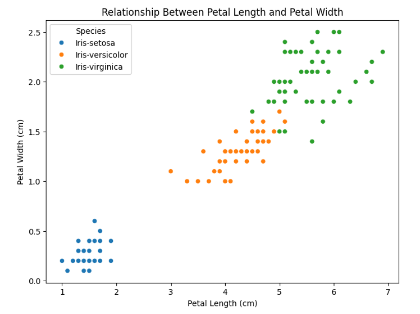
</p>

### Explanation

The scatter plot shows a strong positive relationship between petal length and petal width. The three iris species form distinct clusters, demonstrating that petal measurements are highly effective for species classification.

---

## 10. Scatter Plot: Sepal Length vs Sepal Width

<p align="center">
  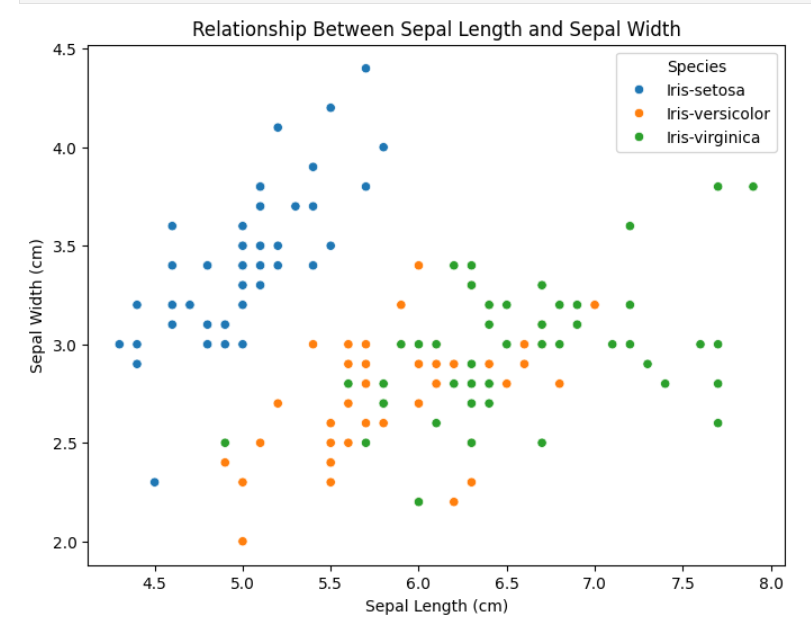
</p>

### Explanation

The scatter plot reveals greater overlap among species compared to petal measurements. While some separation exists, sepal features are less effective for distinguishing iris species.

---

## 11. Histogram: Sepal Length Distribution

<p align="center">
  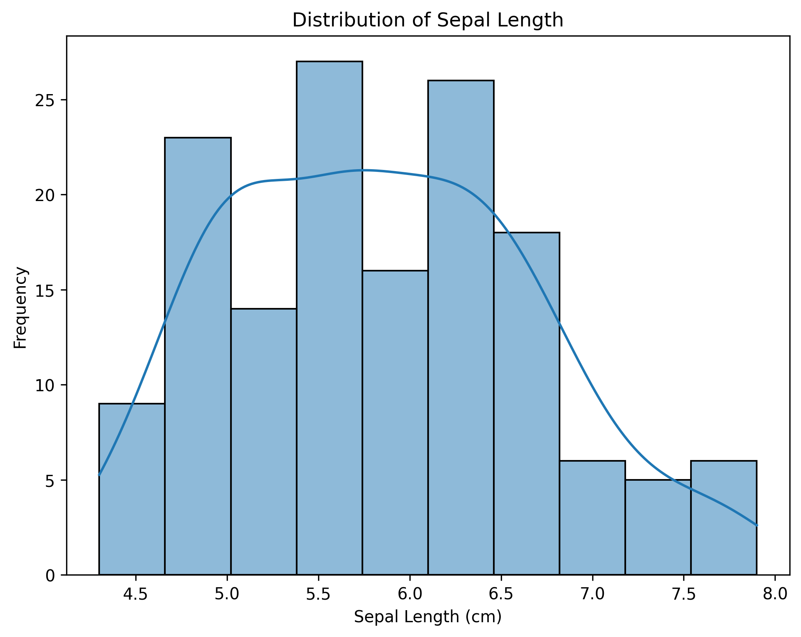
</p>

### Explanation

The histogram illustrates the frequency distribution of sepal length measurements. Most observations are concentrated between approximately 5 and 6.5 centimeters, indicating the common range of sepal lengths in the dataset.

---

## 12. Histogram: Petal Length Distribution

<p align="center">
  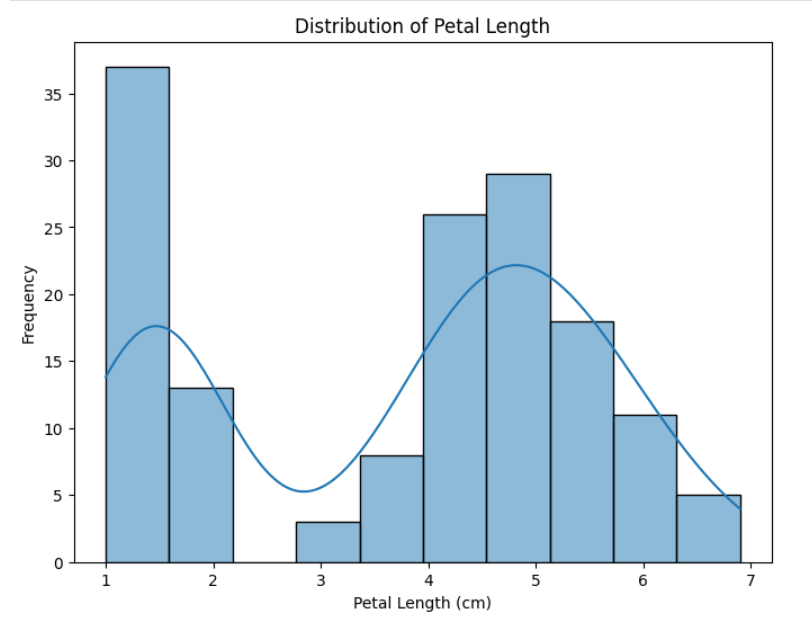
</p>

### Explanation

The petal length distribution shows multiple peaks, reflecting differences among iris species. This pattern suggests that petal length is an important feature for distinguishing flower categories.

---

## 13. Box Plot: Sepal Length by Species

<p align="center">
  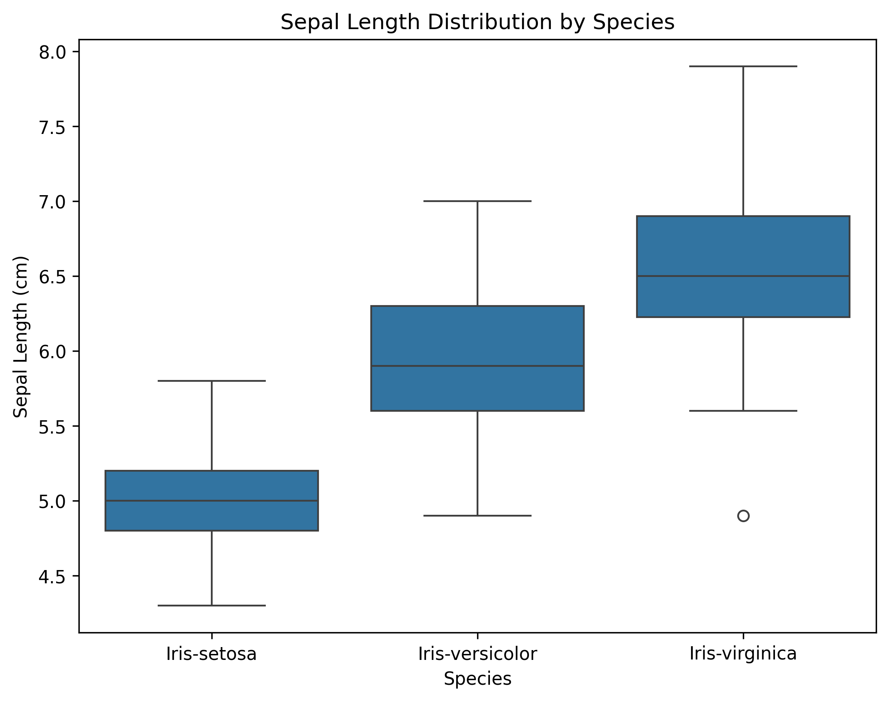
</p>

### Explanation

The box plot compares sepal length distributions across species. Iris-virginica generally has the largest sepal lengths, while Iris-setosa has the smallest. A small number of potential outliers are visible but do not significantly affect the overall analysis.

---

## 14. Box Plot: Petal Length by Species

<p align="center">
  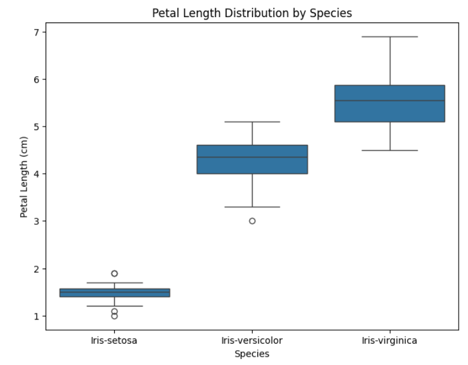
</p>

### Explanation

The box plot highlights clear differences in petal length among species. Iris-setosa has the shortest petals, Iris-versicolor occupies the middle range, and Iris-virginica has the largest petals. The minimal overlap between groups confirms that petal length is a strong discriminating feature.

---

## Key Findings

* The dataset contains 150 records and 6 columns.
* No missing values were found in the dataset.
* No duplicate records were identified.
* Each iris species contains 50 observations, creating a balanced dataset.
* Petal measurements clearly separate the three species.
* Sepal measurements show greater overlap among species.
* Petal length and petal width are the most informative features for species differentiation.
* A few potential outliers were detected, but they do not significantly impact the analysis.

---

## Conclusion

The Iris Dataset was successfully explored and visualized using Python, Pandas, Matplotlib, and Seaborn. Data quality checks confirmed that the dataset is clean, complete, and suitable for analysis.

Various visualizations were used to understand relationships, distributions, and variations within the dataset. The analysis revealed that petal-related features provide better species separation than sepal-related features.

Overall, this project provided practical experience in data loading, data inspection, data summarization, and data visualization. The findings demonstrate how exploratory data analysis can be used to uncover meaningful insights and improve understanding of a dataset before applying advanced analytical or machine learning techniques.

---

## How to Run the Project

## 1. Clone the Repository

```bash
git clone https://github.com/huzaifawaheed2/DevelopersHub-Corporation-Internship.git
```

## 2. Navigate to the Project Folder

```bash
cd DevelopersHub-Corporation-Internship/Project-01-Iris-Analysis
```

## 3. Install Required Libraries

```bash
pip install -r requirements.txt
```

## 4. Open Jupyter Notebook

```bash
jupyter notebook
```

## 5. Run the Notebook

```text
notebooks/iris_analysis.ipynb
```

---

# Author

## Muhammad Huzaifa Waheed

Data Analyst | Power BI Developer | QA Engineer

### Connect With Me

* GitHub: https://github.com/huzaifawaheed2
* LinkedIn: https://www.linkedin.com/in/muhammad-huzaifa-waheed-70043338b

---

⭐ If you found this project useful, consider giving this repository a star.
