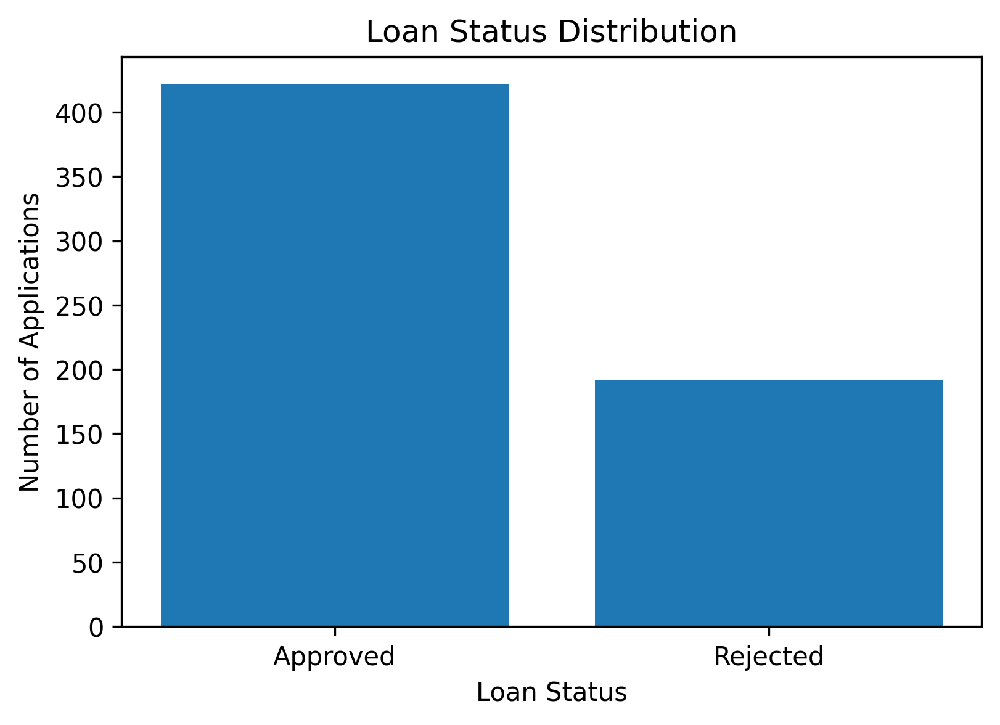
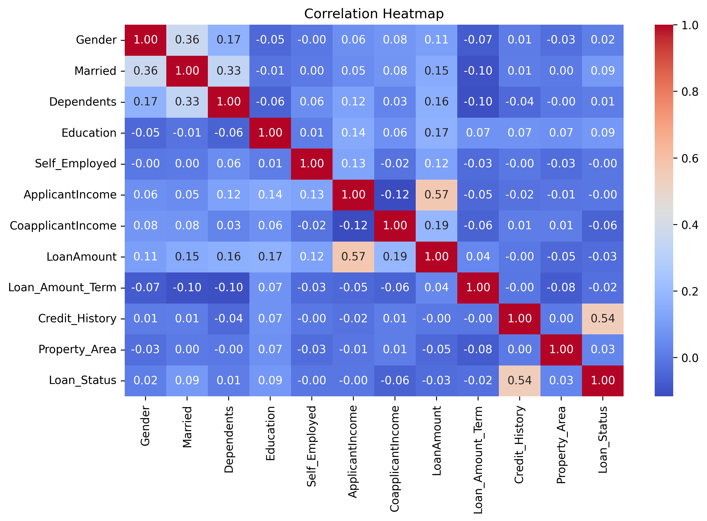
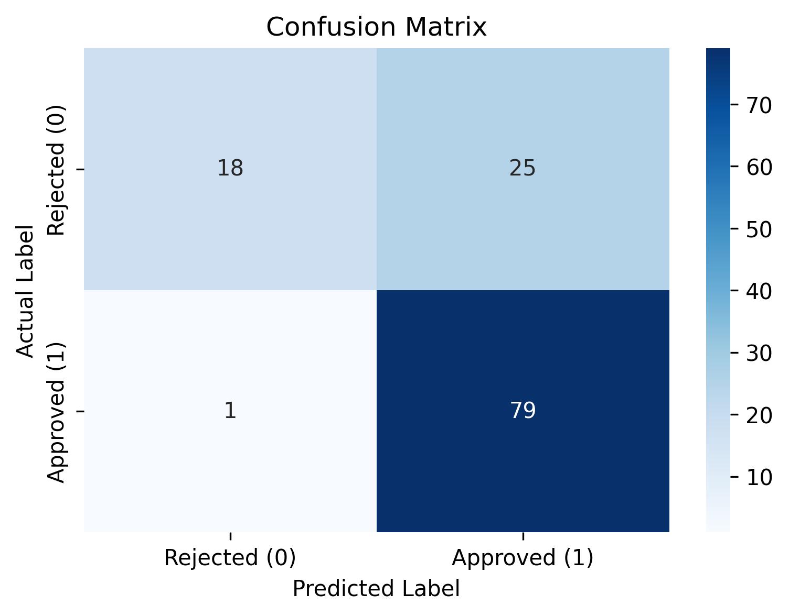

# Project 02: Credit Risk Prediction Using Machine Learning


---

## Table of Contents

* Project Results
* Project Overview
* Project Objectives
* Dataset Information
* Technologies Used
* Project Structure
* Data Cleaning and Preparation
* Exploratory Data Analysis (EDA)
* Model Development
* Model Evaluation
* Key Findings
* Conclusion
* How to Run the Project
* Author

---

## Project Results

| Metric                    | Value     |
| ------------------------- | --------- |
| Dataset Records           | 614       |
| Missing Values Handling   | Completed |
| Duplicate Records Check   | Passed    |
| Categorical Encoding      | Completed |
| Exploratory Data Analysis | Completed |
| Model Training            | Completed |
| Accuracy Score            | 78.86%    |
| Confusion Matrix          | Completed |
| Classification Report     | Completed |

---

## Project Overview

This project focuses on predicting loan approval outcomes using machine learning techniques. The objective is to determine whether a loan application is likely to be approved or rejected based on applicant information such as income, education level, marital status, credit history, loan amount, and property area.

The project demonstrates the complete machine learning workflow, including data preprocessing, exploratory data analysis, model training, and performance evaluation.

This project was completed as part of the **Data Science & Analytics Internship Program**.

---

## Project Objectives

The objectives of this project are:

* Understand the structure of the loan prediction dataset
* Handle missing values and prepare the data
* Perform exploratory data analysis (EDA)
* Visualize important features affecting loan approval
* Train a machine learning classification model
* Evaluate model performance using classification metrics
* Extract meaningful business insights

---

## Dataset Information

**Dataset:** [Loan Prediction Dataset](https://www.kaggle.com/datasets/altruistdelhite04/loan-prediction-problem-dataset)

### Features

| Feature           | Description                            |
| ----------------- | -------------------------------------- |
| Gender            | Applicant Gender                       |
| Married           | Marital Status                         |
| Dependents        | Number of Dependents                   |
| Education         | Education Level                        |
| Self_Employed     | Self Employment Status                 |
| ApplicantIncome   | Applicant Income                       |
| CoapplicantIncome | Co-Applicant Income                    |
| LoanAmount        | Requested Loan Amount                  |
| Loan_Amount_Term  | Loan Term                              |
| Credit_History    | Credit History Status                  |
| Property_Area     | Property Area                          |
| Loan_Status       | Loan Approval Status (Target Variable) |

### Dataset Summary

| Metric            | Value       |
| ----------------- | ----------- |
| Total Records     | 614         |
| Total Columns     | 13          |
| Missing Values    | Handled     |
| Duplicate Records | 0           |
| Target Variable   | Loan_Status |

---

## Technologies Used

* Python
* Pandas
* NumPy
* Matplotlib
* Seaborn
* Scikit-Learn
* Jupyter Notebook

---

## Project Structure

```text
Project-02-Credit-Risk-Prediction/
│
├── dataset/
│   └── train.csv
│
├── notebooks/
│   └── credit_risk_prediction.ipynb
│
├── outputs/
│   └── figures/
│
├── requirements.txt
└── README.md
```

---

## Data Cleaning and Preparation

### Tasks Performed

* Missing values analysis
* Missing value treatment
* Duplicate records verification
* Data type inspection
* Categorical variable encoding
* Dataset preparation for machine learning

---

## Exploratory Data Analysis (EDA)

### Visualizations Performed

* Loan Status Distribution
* Gender Distribution
* Education Distribution
* Property Area Distribution
* Credit History Distribution
* Applicant Income Distribution
* Loan Amount Distribution
* Correlation Heatmap
* Outlier Analysis using Box Plots

---

## Sample Visualizations

### Loan Status Distribution

<p align="center">
  
</p>

### Correlation Heatmap

<p align="center">
  
</p>

### Confusion Matrix Heatmap

<p align="center">
  
</p>

---

## Model Development

### Machine Learning Model

* Logistic Regression

### Dataset Split

| Dataset       | Percentage |
| ------------- | ---------- |
| Training Data | 80%        |
| Testing Data  | 20%        |

---

## Model Evaluation

### Evaluation Metrics

| Metric         | Value  |
| -------------- | ------ |
| Accuracy Score | 78.86% |

### Evaluation Techniques

* Accuracy Score
* Confusion Matrix
* Classification Report

---

## Key Findings

* Credit History showed the strongest influence on loan approval decisions.
* Approved loan applications were significantly more common than rejected applications.
* Applicant Income and Loan Amount contained several high-value observations.
* Logistic Regression achieved satisfactory predictive performance.
* The model performed particularly well in identifying approved loan applications.

---

## Conclusion

This project successfully demonstrates the complete machine learning workflow for credit risk prediction.

After performing data cleaning, feature preparation, and exploratory data analysis, a Logistic Regression model was trained and evaluated using an 80:20 train-test split.

The model achieved an accuracy score of 78.86%, indicating satisfactory performance in predicting loan approval outcomes. The analysis highlighted the importance of credit history and financial characteristics in determining loan approval decisions.

Overall, the project provides a practical example of binary classification using machine learning techniques for credit risk assessment.

---

## How to Run the Project

### 1. Clone the Repository

```bash
git clone https://github.com/huzaifawaheed2/DevelopersHub-Corporation-Internship.git
```

### 2. Navigate to the Project Folder

```bash
cd DevelopersHub-Corporation-Internship/Project-02-Credit-Risk-Prediction
```

### 3. Install Required Libraries

```bash
pip install -r requirements.txt
```

### 4. Open Jupyter Notebook

```bash
jupyter notebook
```

### 5. Run the Notebook

```text
notebooks/credit_risk_prediction.ipynb
```

---

# Author

## Muhammad Huzaifa Waheed

Data Analyst | Power BI Developer | QA Engineer

### Connect With Me

* GitHub: [huzaifawaheed2](https://github.com/huzaifawaheed2)
* LinkedIn: [Muhammad Huzaifa Waheed](https://www.linkedin.com/in/muhammad-huzaifa-waheed-70043338b)

---

⭐ If you found this project useful, consider giving this repository a star.
