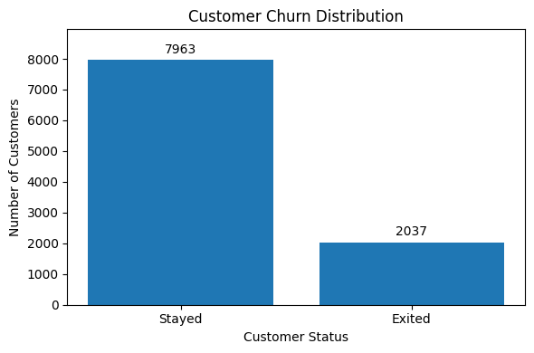
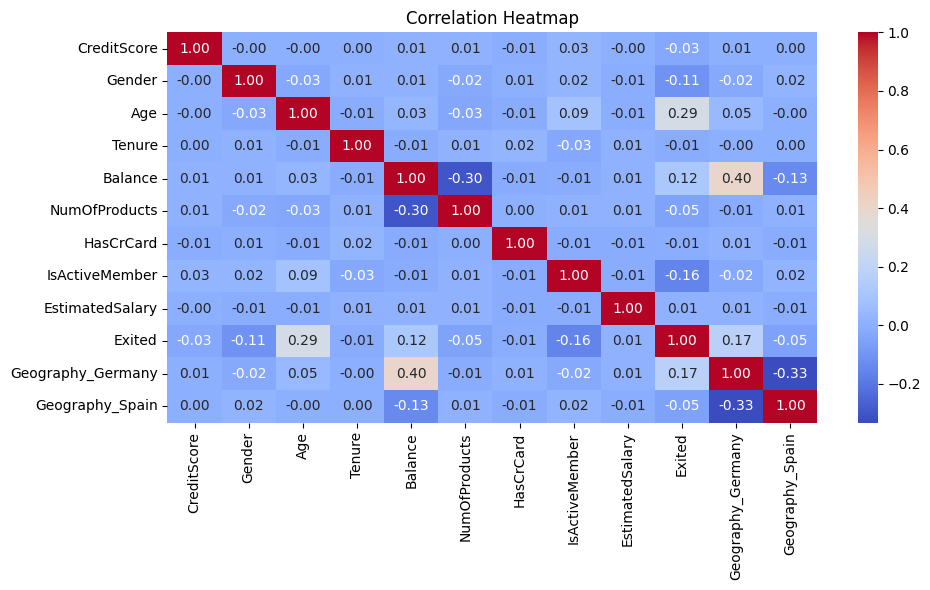
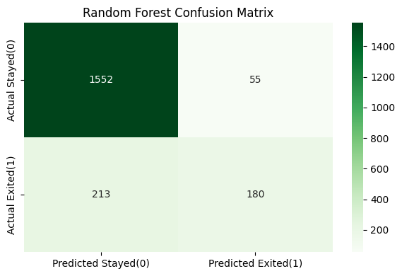

# Project 03: Customer Churn Prediction Using Machine Learning


---

## Table of Contents

* Project Results
* Project Overview
* Project Objectives
* Dataset Information
* Technologies Used
* Project Structure
* Data Cleaning and Preparation
* Exploratory Data Analysis (EDA)
* Model Development
* Model Evaluation
* Feature Importance Analysis
* Key Findings
* Conclusion
* How to Run the Project
* Author

---

## Project Results

| Metric                    | Value     |
| ------------------------- | --------- |
| Dataset Records           | 10,000    |
| Missing Values Handling   | Completed |
| Duplicate Records Check   | Passed    |
| Feature Encoding          | Completed |
| Exploratory Data Analysis | Completed |
| Logistic Regression       | Completed |
| Random Forest             | Completed |
| Best Model Accuracy       | 86.60%    |
| Confusion Matrix          | Completed |
| Classification Report     | Completed |

---

## Project Overview

This project focuses on predicting customer churn in a banking environment using machine learning techniques.

Customer churn refers to customers leaving a bank and discontinuing its services. Identifying customers who are likely to churn helps organizations improve customer retention strategies and reduce revenue loss.

The project demonstrates the complete machine learning workflow, including data preprocessing, exploratory data analysis, feature engineering, model training, evaluation, and feature importance analysis.

This project was completed as part of the **Data Science & Analytics Internship Program**.

---

## Project Objectives

The objectives of this project are:

* Understand customer churn behavior
* Perform data cleaning and preprocessing
* Conduct exploratory data analysis (EDA)
* Identify factors affecting customer churn
* Train machine learning classification models
* Evaluate model performance
* Compare multiple machine learning models
* Generate business insights for customer retention

---

## Dataset Information

**Dataset:** [Bank Customer Churn Prediction Dataset](https://www.kaggle.com/datasets/shrutimechlearn/churn-modelling)

### Features

| Feature         | Description                             |
| --------------- | --------------------------------------- |
| CreditScore     | Customer Credit Score                   |
| Geography       | Customer Country                        |
| Gender          | Customer Gender                         |
| Age             | Customer Age                            |
| Tenure          | Years with Bank                         |
| Balance         | Account Balance                         |
| NumOfProducts   | Number of Bank Products                 |
| HasCrCard       | Credit Card Ownership                   |
| IsActiveMember  | Active Membership Status                |
| EstimatedSalary | Estimated Salary                        |
| Exited          | Customer Churn Status (Target Variable) |

### Dataset Summary

| Metric            | Value  |
| ----------------- | ------ |
| Total Records     | 10,000 |
| Total Columns     | 11     |
| Missing Values    | 0      |
| Duplicate Records | 0      |
| Target Variable   | Exited |

---

## Technologies Used

* Python
* Pandas
* NumPy
* Matplotlib
* Seaborn
* Scikit-Learn
* Jupyter Notebook

---

## Project Structure

```text
Project-03-Customer-Churn-Prediction/
│
├── dataset/
│   └── Churn_Modelling.csv
│
├── notebooks/
│   └── customer_churn_prediction.ipynb
│
├── outputs/
│   └── figures/
│
├── requirements.txt
└── README.md
```

---

## Data Cleaning and Preparation

### Tasks Performed

* Missing values analysis
* Duplicate records verification
* Data type inspection
* Feature encoding
* Dataset preparation for machine learning
* Feature scaling

---

## Exploratory Data Analysis (EDA)

### Visualizations Performed

* Customer Churn Distribution
* Gender Distribution
* Geography Distribution
* Customer Churn by Gender
* Customer Churn by Geography
* Age Distribution
* Credit Score Distribution
* Balance Distribution
* Estimated Salary Distribution
* Customer Churn by Active Membership
* Customer Churn by Number of Products
* Customer Churn by Credit Card Status
* Correlation Analysis
* Correlation Heatmap

---

## Sample Visualizations

### Customer Churn Distribution

<p align="center">
  
</p>

### Correlation Heatmap

<p align="center">
  
</p>

### Random Forest Confusion Matrix

<p align="center">
  
</p>

---

## Model Development

### Machine Learning Models

* Logistic Regression
* Random Forest Classifier

### Dataset Split

| Dataset       | Percentage |
| ------------- | ---------- |
| Training Data | 80%        |
| Testing Data  | 20%        |

---

## Model Evaluation

### Evaluation Metrics

| Model               | Accuracy |
| ------------------- | -------- |
| Logistic Regression | 81.10%   |
| Random Forest       | 86.60%   |

### Evaluation Techniques

* Accuracy Score
* Confusion Matrix
* Classification Report
* Model Comparison

---

## Feature Importance Analysis

Top features identified by the Random Forest model:

1. Age
2. Estimated Salary
3. Credit Score
4. Balance
5. Number of Products

These variables contributed the most to customer churn prediction.

---

## Key Findings

* Age was the most influential factor affecting customer churn.
* Customers with higher balances showed increased churn tendencies.
* Active members were less likely to leave the bank.
* Customers with multiple products exhibited different churn behaviors.
* Random Forest significantly outperformed Logistic Regression.
* Customer demographics and financial characteristics strongly influenced churn prediction.

---

## Conclusion

This project successfully demonstrates the complete machine learning workflow for customer churn prediction.

After performing data preprocessing, exploratory data analysis, feature scaling, and model development, two machine learning models were evaluated.

The Logistic Regression model achieved an accuracy of 81.10%, while the Random Forest model achieved 86.60% accuracy and demonstrated superior churn detection performance.

Feature importance analysis identified Age, Estimated Salary, Credit Score, Balance, and Number of Products as the most influential predictors of customer churn.

Overall, Random Forest was selected as the final model due to its stronger predictive performance and improved ability to identify customers at risk of leaving the bank.

---

## How to Run the Project

### 1. Clone the Repository

```bash
git clone https://github.com/huzaifawaheed2/DevelopersHub-Corporation-Internship.git
```

### 2. Navigate to the Project Folder

```bash
cd DevelopersHub-Corporation-Internship/Project-03-Customer-Churn-Prediction
```

### 3. Install Required Libraries

```bash
pip install -r requirements.txt
```

### 4. Open Jupyter Notebook

```bash
jupyter notebook
```

### 5. Run the Notebook

```text
notebooks/customer_churn_prediction.ipynb
```

---

# Author

## Muhammad Huzaifa Waheed

Data Analyst | Power BI Developer | QA Engineer

### Connect With Me

* GitHub: https://github.com/huzaifawaheed2
* LinkedIn: https://www.linkedin.com/in/muhammad-huzaifa-waheed-70043338b

---

⭐ If you found this project useful, consider giving this repository a star.
